# SIIU APP - Desarrollo con Cursor

Este proyecto representa la implementación de una aplicación móvil estudiantil utilizando Cursor como IDE principal. La aplicación es una reimaginación moderna del Sistema Integrado de Información Universitaria (SIIU), desarrollada con React Native y Expo.

## 👨‍💻 Autor

**Christopher Pallo -**
SI10 P01 – Sistemas de Información -
Universidad Central del Ecuador

## Proceso de Desarrollo con Cursor

El desarrollo de esta aplicación se realizó utilizando Cursor, un IDE potenciado por IA que facilitó significativamente el proceso de desarrollo. Algunas de las ventajas clave de usar Cursor en este proyecto fueron:

- **Generación Asistida de Código**: Utilización de IA para generar componentes y estructuras de código base.
- **Refactorización Inteligente**: Mejoras automáticas en la calidad y estructura del código.
- **Debugging Eficiente**: Identificación y corrección rápida de errores con ayuda de la IA.
- **Completado de Código Contextual**: Sugerencias inteligentes basadas en el contexto del proyecto.

## Del Diseño a la Implementación

### Diseño en Figma

#### Pantalla de Inicio
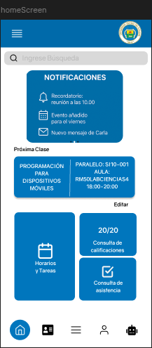


#### Carnet Estudiantil
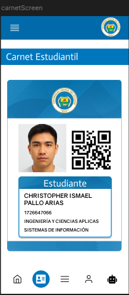

#### Menú Principal
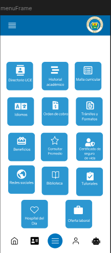

#### Perfil de Usuario
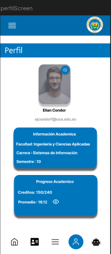

#### Bot Asistente
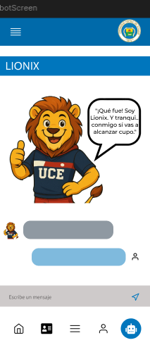

#### Menú Lateral
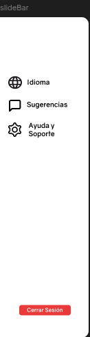

### Implementación Final

#### Pantalla de Inicio
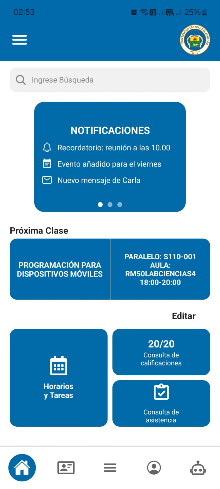

#### Carnet Estudiantil
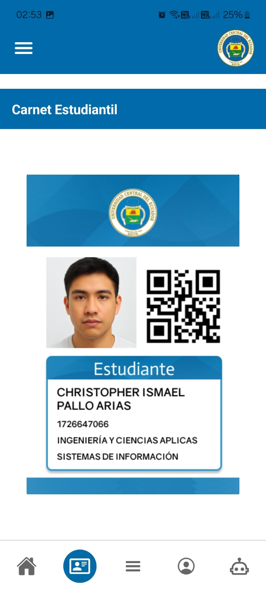

#### Menú Principal
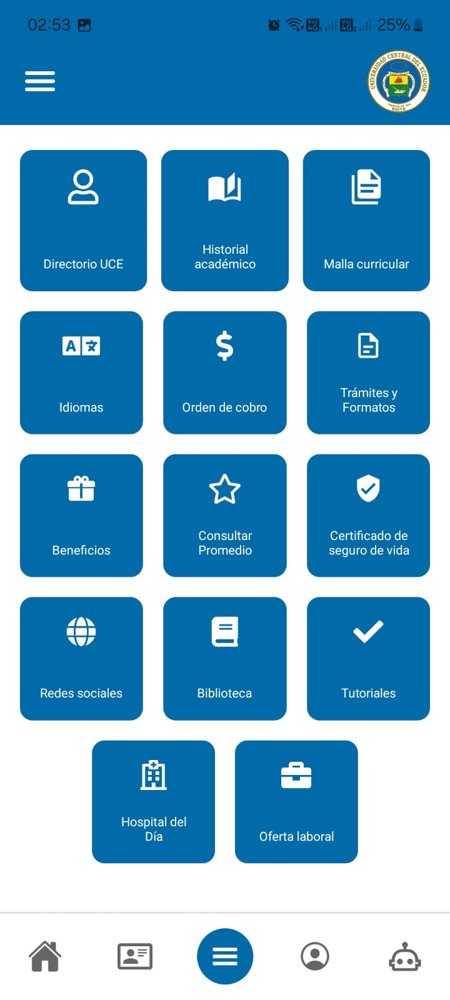

#### Perfil de Usuario
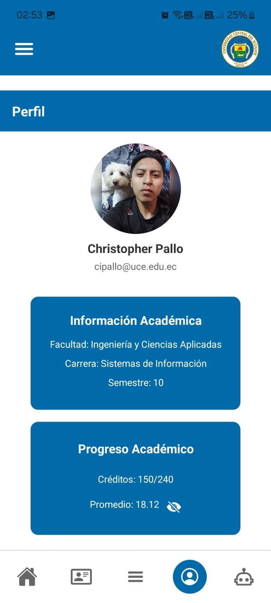

#### Bot Asistente
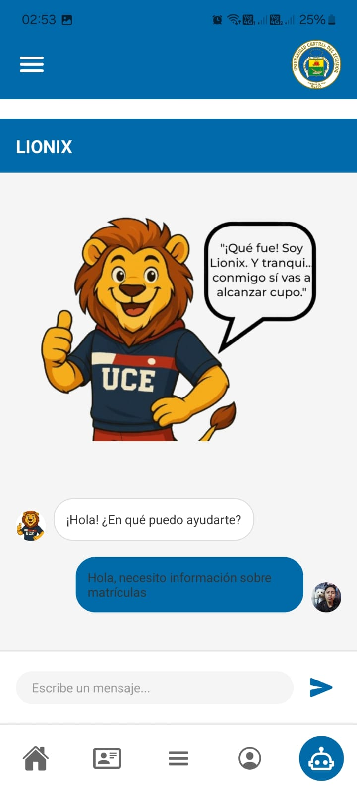

#### Menú Lateral
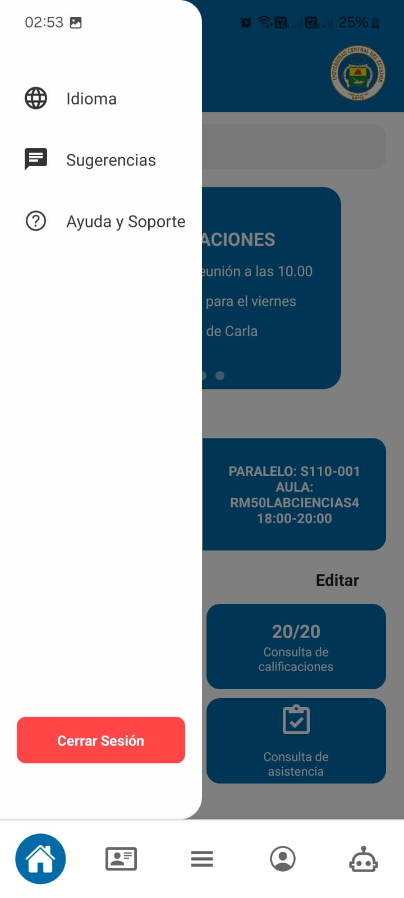

## 🧩 Características Implementadas

### 1. Pantalla de Inicio (Home)
- Header con menú hamburguesa y logo institucional
- Buscador integrado
- Sistema de notificaciones deslizable (3 páginas)
- Sección "Próxima Clase"
- Sección "Editar" con tres recuadros

### 2. Carnet Estudiantil
- Visualización digital del carnet
- Diseño moderno con información del estudiante
- Integración de fotografía

### 3. Menú Principal
- Diseño en cuadrícula con botones
- Navegación intuitiva
- Accesos directos a funcionalidades principales

### 4. Perfil de Usuario
- Información académica en tarjetas
- Gestión de datos personales
- Visualización de promedio con opción de ocultar

### 5. Bot Asistente
- Interfaz de chat interactiva
- Mascota personalizada
- Sistema de mensajería

### 6. Menú Lateral (SlideBar)
- Navegación principal
- Opciones de configuración
- Cerrar sesión

## 🛠️ Tecnologías Utilizadas
- React Native
- Expo
- TypeScript
- React Navigation
- Expo Vector Icons

## 📁 Estructura del Proyecto
```
app/
├── (tabs)/
│   ├── home.tsx
│   ├── carnet.tsx
│   ├── menu.tsx
│   ├── perfil.tsx
│   └── bot.tsx
├── components/
│   ├── Header.tsx
│   ├── SlideBar.tsx
│   └── [otros componentes]
└── assets/
    ├── figma/
    │   └── [capturas de diseño]
    ├── screenshots/
    │   └── [capturas de implementación]
    └── app/
        └── [recursos de la aplicación]
```

## 🚀 Instalación y Configuración

1. Clonar el repositorio:
```bash
git clone [URL_DEL_REPOSITORIO]
```

2. Instalar dependencias:
```bash
npm install
```

3. Iniciar la aplicación:
```bash
npx expo start
```

## 💡 Comparativa de Desarrollo

### Ventajas del Uso de Cursor
- Desarrollo más rápido y eficiente
- Generación de código consistente
- Integración natural con React Native y TypeScript
- Facilidad en la implementación de componentes complejos
- Debugging asistido por IA

### Retos y Soluciones
- **Reto 1**: Implementación del menú deslizable
  - *Solución*: Uso de animaciones nativas y estados controlados
- **Reto 2**: Diseño responsive del carnet
  - *Solución*: Implementación de dimensiones relativas y flexbox
- **Reto 3**: Integración del chat bot
  - *Solución*: Desarrollo de interfaz modular y sistema de mensajería
